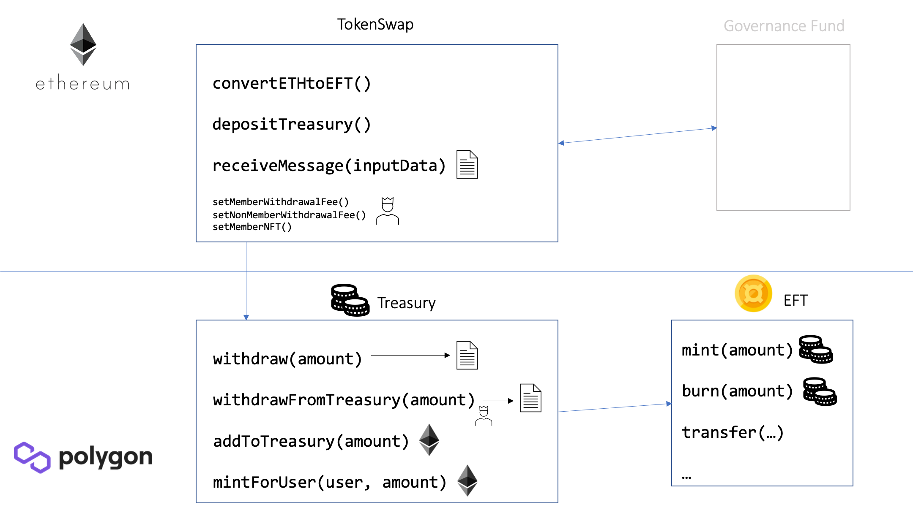

# Ethereum <-> Polygon Token Swap Contracts

Smart contracts to bridge a custom ERC20 token called EFT (backed by ETH in a customizable proportion) to Polygon and back to Ethereum (for redemption of the ETH). Additionally, there are withdrawal fees that can be reduced when the user holds a certain NFT.



The contracts are used to swap between Ethereum (on the Ethereum blockchain) and the EFT token (on the Polygon blockchain) and vice-versa. For every 1000 EFT tokens (using the default proportion) that are minted on Polygon, there exists 1 ETH on Ethereum that is deposited in the governance fund. On the other hand, whenever a user burns 1000 EFT, 1 ETH can be redeemed from the `TokenSwap` contract on Ethereum.

## Deployment

For the deployment, the example scripts `scripts/deploy_eth.js` and `scripts/deploy_polygon.js` are provided. Note that the `Treasury` contract expects the address of the Ethereum `TokenSwap` contract in the constructor (which is passed via the environment variable `TOKENSWAP`), the Ethereum deployment has therefore to happen first.
After the `Treasury` contract is deployed, this address also has to be communicated to the `TokenSwap` contract by calling `setFxChildTunnel` with the (Polygon) address.

In `scripts/deploy_eth.js`, the governance fund is currently set to the address of the deployer. This needs to be changed for a real deployment.

## Usage

### Converting ETH to EFT

#### Buying EFT
Users that want to buy EFT with ETH send ETH to `convertETHtoEFT`. The ETH is sent to the governance fund and a message is transmitted to Polygon that increases the users's EFT balance (i.e., new EFTs are minted for the user).

#### Funding the Treasury
To fund the `Treasury` contract on Polygon with EFTs, the `depositTreasury` method is used. All of the sent ETH is sent to the governance fund and a message is transmitted to Polygon that increases the EFT balance of the `Treasury` contract itself. Everyone can fund the treasury, but in practice this will only be done by the governance fund, because the resulting EFTs are not added to a user's balance, i.e. a user has no incentive to fund the treasury.

### Withdrawing EFT from Polygon
When a user wants to withdraw EFT tokens from Polygon (and get ETH on Ethereum), he calls `withdraw` on the Polygon `Treasury` contract.
The `Treasury` burns the coins of the user and generates an event that can be relayed to Ethereum. Note that these events are not automatically relayed to Ethereum, this has to be done by the user (or alternatively some relayer bot).

For the relaying, a withdraw proof based on the event has to be generated. This is illustrated in the script `scripts/withdraw_proof.mjs`.
In this script, `txnHash` has to be replaced with the transaction hash of the previous transaction (where `withdraw` was called). Of course, this will be done dynamically in practice (e.g., in the frontend or backend).
The generated `proof` (a long hex string) can then be used to call `receiveMessage` on the Ethereum `TokenSwap` contract, which will pay out the requested amount (in ETH, i.e. divided by 1,000) to the user that initiated the withdrawal on Polygon.

## Testing

```
npx hardhat test
```
Note that some test (because of the checkpoint manager validation) run forked on Goerli, which is configured in `hardhat.config.js`.